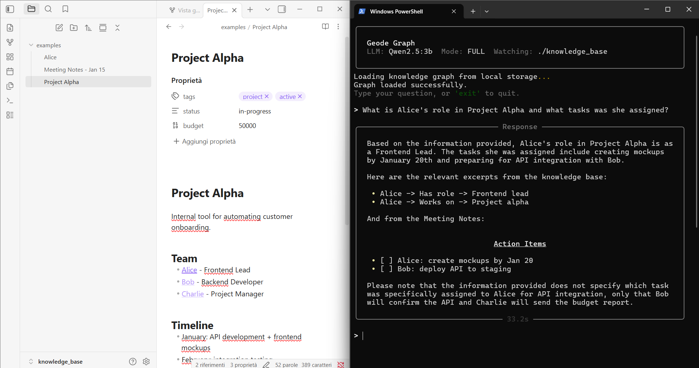
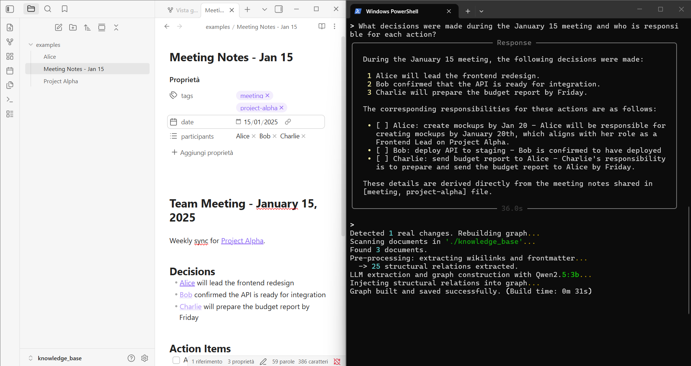

# Geode Graph

A local Graph RAG system that turns your markdown notes into a queryable knowledge graph. Ask questions in natural language and get answers that connect information across multiple files.

Built for [Obsidian](https://obsidian.md/) vaults but works with any folder of markdown files.





## Features

- **Property Graph Index** — builds a knowledge graph from your notes using LLM-extracted relationships
- **Obsidian-native** — automatically parses `[[wikilinks]]` and YAML frontmatter into structured graph triples
- **Multilingual** — supports Italian, English, French, German, Spanish, Portuguese (auto-detected)
- **Hybrid retrieval** — combines 4 retrieval strategies:
  - LLM synonym expansion (optional, disable with `--fast`)
  - Vector similarity search
  - BM25 keyword scoring
  - Temporal/metadata matching
- **Real-time sync** — watches your folder for changes and updates the graph automatically
- **Anti-hallucination prompt** — strict instructions to cite sources and avoid inventing facts
- **Fully local** — runs on Ollama, no data leaves your machine

## Requirements

- Python 3.11+
- [Ollama](https://ollama.ai/) running locally
- An LLM model (e.g. `llama3.1:8b`, `qwen2.5:7b`, `mistral:7b`)
- An embedding model (default: `nomic-embed-text`)

## Setup

```bash
# Install dependencies
pip install -r requirements.txt

# Pull models in Ollama
ollama pull llama3.1:8b
ollama pull nomic-embed-text
```

Edit `geode_graph.py` to set your model:

```python
MODEL_NAME = "llama3.1:8b"  # or any model available in Ollama
```

## Usage

```bash
# Full mode (all retrievers, best quality)
python geode_graph.py

# Fast mode (skips LLM synonym retriever, ~50% faster per query on CPU)
python geode_graph.py --fast
```

Place your markdown files in `./knowledge_base/` (or change `KNOWLEDGE_DIR` in the config). The system will build the graph on first run and watch for changes.

## How It Works

```
Your Notes (.md)
      │
      ▼
┌─────────────────────┐
│   Pre-processing    │  ← Extracts [[wikilinks]], YAML frontmatter
│   (lang_config.py)  │  ← Infers relations from context
└─────────┬───────────┘
          │
          ▼
┌─────────────────────┐
│   LLM Extraction    │  ← Extracts additional entity-relation triples
│   (SimpleLLMPath)   │
└─────────┬───────────┘
          │
          ▼
┌─────────────────────┐
│  Property Graph     │  ← Merges structural + LLM triples
│  Index              │  ← Persisted to disk (storage_graph/)
└─────────┬───────────┘
          │
          ▼
┌─────────────────────┐
│  Hybrid Retrieval   │  ← Synonym + Vector + BM25 + Temporal
└─────────┬───────────┘
          │
          ▼
┌─────────────────────┐
│  LLM Response       │  ← Generates answer from retrieved context
└─────────────────────┘
```

## Project Structure

```
├── geode_graph.py       # Main application
├── lang_config.py       # Multilingual configuration (stopwords, patterns, relations)
├── requirements.txt     # Python dependencies
├── knowledge_base/      # Your notes go here
│   └── examples/        # Example notes to get started
└── storage_graph/       # Generated graph index (auto-created, gitignored)
```

## Pointing to an Obsidian Vault

Change `KNOWLEDGE_DIR` to your vault path:

```python
KNOWLEDGE_DIR = "C:/Users/YourName/Documents/MyVault"
```

The system reads files without modifying them. It ignores `.obsidian/` configuration files automatically.

## Model Recommendations

| Model | RAM (Q4) | Quality | Speed (CPU) | Speed (GPU) |
|-------|----------|---------|-------------|-------------|
| 1B    | ~2 GB    | Basic   | ~8s         | ~2s         |
| 3B    | ~3 GB    | Good    | ~60s        | ~8s         |
| 7-8B  | ~5-6 GB  | Great   | ~300s       | ~15-25s     |
| 20B   | ~12 GB   | Best    | N/A         | ~15s        |

For serious use, 7B+ with a GPU is the sweet spot.

## Build Time Estimates

First-time graph construction requires an LLM call for each document chunk. Subsequent runs load the graph from disk instantly.

| Notes | GPU (7B) | CPU (7B) | CPU (3B) |
|-------|----------|----------|----------|
| 5     | ~2 min   | ~5 min   | ~3 min   |
| 20    | ~7 min   | ~20 min  | ~10 min  |
| 50    | ~17 min  | ~50 min  | ~25 min  |
| 100   | ~35 min  | ~100 min | ~50 min  |
| 500+  | ~3 hrs   | Not recommended | ~4 hrs |

Adding a single new file is incremental (~20-60s) and does not rebuild the full graph.

## Resource Usage

| Component | RAM | Notes |
|-----------|-----|-------|
| Ollama (LLM) | 2-14 GB | Depends on model size and quantization |
| Ollama (embeddings) | ~300 MB | nomic-embed-text |
| Geode Graph (indexing) | 0.5-4 GB | Depends on number of notes |
| Geode Graph (queries) | 200-500 MB | After graph is built |
| **Total (7B Q4)** | **~8-12 GB** | **Recommended minimum: 16 GB system RAM** |

## Tip: Use Cloud Models for Graph Building

If your hardware is limited, you can use a powerful cloud model via Ollama to build the graph once, then switch to a smaller local model for daily queries. The graph is persisted to disk, so you only need the large model during construction.

```bash
# Step 1: Build the graph with a cloud model (one-time, high quality extraction)
# Edit MODEL_NAME = "gpt-oss:20b-cloud" in geode_graph.py, then run:
python geode_graph.py
# Wait for "Graph built and saved successfully", then exit.

# Step 2: Switch to a small local model for queries (fast, low resource)
# Edit MODEL_NAME = "qwen2.5:3b" in geode_graph.py, then run:
python geode_graph.py --fast
```

This gives you the best of both worlds: a high-quality graph built by a 20B+ model, with fast and lightweight queries on a 3B model. The graph structure (entities, relations, triples) doesn't change when you switch models — only the response generation uses the smaller model.

## Roadmap

- **Telegram Bot** — Query your Obsidian vault or knowledge base from anywhere via Telegram. Ask questions on the go and get answers grounded in your notes.

## License

MIT
